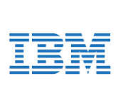
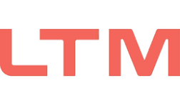

# Shivaditya Upadhyay
 
#### Data, AI and BI Specialist 
#### [Contact now!](mailto:shiv45aditya@gmail.com)

* [Download Resume](port/cv.pdf)                                                                                     
* [Testimonial](https://drive.google.com/file/d/1MFLmGetfQrPCuNGL7iZbHuMSQYcRX5nu/view)
* [LinkedIn](https://www.linkedin.com/in/shivaditya-u/)

### Currently a Student studying AI and Data Science Saarbrücken

## Overview

I solve business problems with the most optimal tech stack while prioritising efficiency and I'm currently looking for relevant opportunities. I'm proficient in English and German at C1 level, details are in my CV. I can travel frequently and I'm open to relocation within Germany. My background includes BI, ML, data engineering, and full-stack development, with published research in quantitative finance and algorithmic trading. You have tried the rest, now go with the best!

## Officially Certified by Leading Companies 
###[View Certifications](https://drive.google.com/drive/folders/15718d5TXYdrOKzFnD1-cro0rJC7dkjW4?usp=sharing)

  
  

## Technical Skills 

### My experience with diverse tech stacks will allow me to transfer my learning, and hit the ground running at your organisation! More skills are listed in my CV.

#### Languages & Scripting

Python, Java, JavaScript, C++, SQL, Bash, Linux, HTML, GraphQL

#### Core Technical Areas

Machine Learning, Deep Learning, NLP, Computer Vision, Data Engineering, Data Analysis, Data Visualization, Feature Engineering, Time Series Analysis, Statistical Modeling, Agentic AI, RAG, LLM Prompt Engineering, CI/CD, Research

#### Tools & Platforms

Azure, AWS, GCP, Docker, Kubernetes, Power BI, Tableau, PySpark, HuggingFace, Jupyter, Airflow, Kafka, LangChain, N8n, LangGraph, MLflow, Terraform, Postman, Prometheus

#### Libraries & Frameworks

Pandas, NumPy, Scikit-learn, PyTorch, TensorFlow, Fastai, Django, Flask, SQLAlchemy, XGBoost, Keras, Celery, Redis, ONNX, Vue.js

## Work Experience

**Business Intelligence Specialist – AI and Data @ Enpal GmbH (*March 2025 – January 2026*)**                                                 

* Remote
* Worked on AI, analytics, and business intelligence initiatives.

**Software Engineer Intern @ Kreativstorm LLC (*February 2025 – March 2025*)**                                                                

* Remote
* Contributed to software engineering and development projects.

**Data Engineer Contractor @ LTIMindtree (*August 2024 – February 2025*)**                                                                    

* Pune, India
* Developed and maintained data engineering solutions and pipelines.

## Projects & Research

### Enhancing Passive Index Investing: Augmenting Volatility Harvesting with Machine Learning Models for Higher Returns

[IEEE (In Press)](https://drive.google.com/file/d/1AYokkDtHOArrGklKLQp1LjHiH_Gw0GlG/view?usp=sharing)

Research focused on improving passive index investing strategies by integrating machine learning models with volatility harvesting techniques to enhance long-term portfolio returns.

### Automation of Black-Litterman Asset Allocation Model using Machine Learning for Algorithmic Stock Trading

[Under Review](https://drive.google.com/file/d/1BHMVJJbDhD4owDgeNsDkaY_lHaH9qGz-/view?usp=sharing)

Developed an automated framework combining the Black-Litterman asset allocation model with machine learning techniques for algorithmic stock trading and portfolio optimization.

  ## Still not sure? Go through my [Testimonial](https://drive.google.com/file/d/1MFLmGetfQrPCuNGL7iZbHuMSQYcRX5nu/view)
